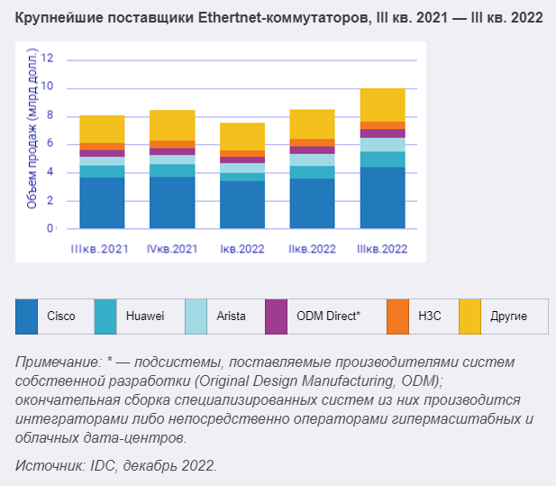

# Выбор источников на поддержку
*Предварительно сделаем допущение, что продукт не имеет поддержки никаких источников и еще готовится к выпуску.*

В качестве потенциальных источников логов безопасности могут выступать:
- Журналы операционной системы серверов и рабочих станций
- Журналы приложений (например, веб-сервер, сервер баз данных)
- Журналы инструментов безопасности (например, антивирус, инструменты обнаружения изменений, системы обнаружения/предотвращения вторжений)
- Исходящие журналы прокси-сервера и журналы приложений конечных пользователей

Сделовательно первоочередно собираем логи от операционных систем. Для серверов наиболее популярны unix-овые системы, рабочие станции пользователей большей частью работают с windows. Таким образом поддерживаем обе ОС.

Далее компьютеры образуют сеть и обмениваются информацией, используя сетевое оборудование. Несмотря на геополитические события, думаю, доля Cisco на рынке всё еще остается достаточно большой, чтобы поддержать его как основной сетевой источник.

Наряду с этим на рынке есть решения Huawei, D-Link, Alcatel, Microtik и т.д. На 2-3 месте по объему продаж идет Huawei. Будем рассматривать его как второй сетевой источник на поддержку.

В качестве систем безопасности используются решения drWeb, ESET, Kaspersky и т.д. Отдадим предпочтение Kaspersky как крупному российскому игроку.

Т.к. корпоративная электронная почта есть в каждой компании, поддержим самый известный почтовый сервер - Exchange.

Следующим в списке будут базы данных. Сделаем ставку на массовый переезд на postresql и будем в первую очередь поддерживать её.

Далее рассмотрим серверное ПО, в частности веб-сервера. Наиболее популярные веб‑серверы — это Nginx и Apache. При этом Nginx занимает значительную долю рынка, с него и начнем поддержку.

В качестве CRM системы будем поддерживать Битрикс.

Среди ERP систем отдадим предпочтение 1С как российскому ПО.

Из систем серверной виртуализации в первую очередь поддержим VMware, зная о российских разработках типа zVirt, Брест и т.д.

Еще я бы отдала предпочтение облачным системам, yandex cloud или vk cloud.

Последние источники я бы добрала из альтернатив для типов выше. Т.е. например, еще одну БД, еще одну систему безопасности и т.д.

В итоге получаем следующий список поддержки ИС в порядке приоритета:

1. Linux
2. Windows
3. Cisco
4. Huawei
5. Kaspersky
6. Postresql
7. VMware vSphere
8. Nginx
9. Exchange
10. Bitrix
11. 1C
12. yandex cloud/vk cloud
13. MySql
14. drWeb
15. zVirt

## Типы собираемых событий

Для каждой категории источников выделим основные типы собираемых событий.

Для ОС:
| Тип события |
| ----------- |
| Успешные/неуспешные события входа/выхода пользователя |
| Изменение аккаунта (в том числе изменение пароля)     |
| Создание/удаление групп пользователей/пользователей   |
| Создание/удаление пользователя                        |
| Добавление/удаление пользователя из группы            |
| Запуск/остановка сервисов                             |
| (Для Linux) Действия sudo                             |
| Изменение доступа к объекту                           |

Для сетевых устройств:

| Тип события |
| ----------- |
| Заблокированный трафик |
| Создание/удаление/изменение аккаунта |
| Установление/закрытие соединения |
| Успешная/неуспешная аутентификация пользователя |

Для БД:

| Тип события |
| ----------- |
| Успешные/неуспешные события входа/выхода пользователя |
| Удаление/создание/изменение пользователя |
| Изменение прав пользователя |
| Просмотр конфигурации БД |
| Управление правами доступа к объекту в базе данных |
| Операция с учетными данными пользователей в базе данных |

Для веб-сервера:

| Тип события |
| ----------- |
| Остановка/запуска/сбой веб-службы |
| Ошибки аутентификации             |
| Неверный запрос                   |
| Внутренние ошибки сервера         |

Для систем защиты:

| Тип события |
| ----------- |
| Изменение конфигурации      |
| Отключение служб            |
| Обнаружение атаки           |
| Обнаружение уязвимости      |
| Ошибки сканирования объекта |

Для систем виртуализации:
| Тип события |
| ----------- |
| Создание/удаление/изменение учетной записи            |
| Создание/удаление/изменение роли                      |
| Назначение роли пользователю                          |
| Создание/клонирование/удаление виртуальной машины     |
| Изменение конфигурации                                |
| Успешные/неуспешные события входа/выхода пользователя |

Для exchange:
| Тип события |
| ----------- |
| Успешные/неуспешные события входа/выхода пользователя                 |
| Успешные/неуспешные события входа/выхода с правами администратора     |
| Действия пользователя (создание/удаление/отправка и т.д.)             |
| Успешное/неуспешное выполнение команд                                 |
| Запуск/остановка процессов                                            |

Для CRM/ERP систем:

| Тип события |
| ----------- |
| События логин/логаута                                   |
| Создание/удаление/изменение учетной записи пользователя |
| Изменение политик группы                                |
| Назначение/отзыв прав                                   |
| Изменение прав на объект                                |
| Создание/удаление/проведение документа                  |

Для облачных систем:

| Тип события |
| ----------- |
| Изменение прав доступа/сетевых политик                     |
| Создание/просмотр/удаление/изменении информации об объекте |
| Доступ к объектам с конфинденциальными данными             |
| Удаление бэкапов                                           |
